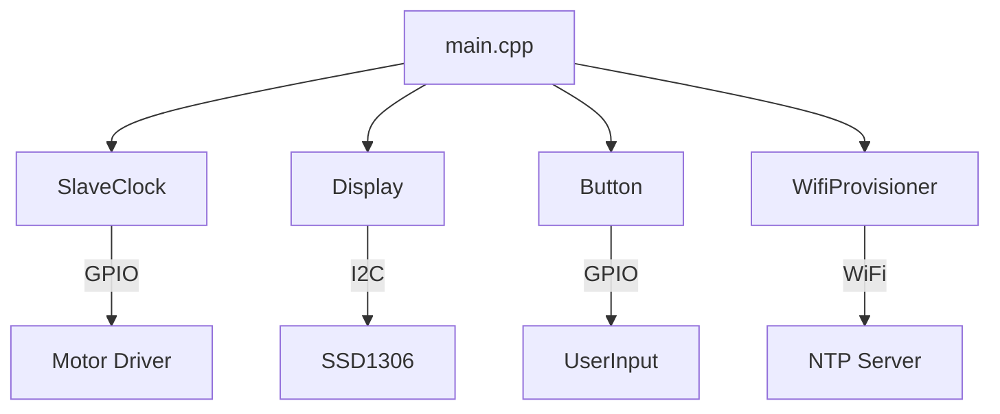

# ESP32-C3 Slave Clock Controller

A compact, affordable, and robust controller for analog slave clocks and flip clocks (e.g., Bodet), based on the **ESP32-C3** microcontroller and the **DRV8871** H-Bridge driver.

## 📖 Overview

This project replaces bulky and expensive master clocks with a tiny PCB powered by a single Li-Ion battery. It synchronizes time via NTP and offers a web-based configuration interface.

**Key Features:**
* **Universal Support:** Works with standard 12V/24V slave clocks and Bodet flip clocks (including date motor support).
* **Compact Design:** Built around the tiny ESP32-C3 (RISC-V) and DRV8871.
* **Battery Backup:** Integrated TP4056 charging logic with deep discharge protection; keeps time during power outages.
* **WiFi Provisioning:** Easy setup via a Captive Portal (no hardcoded credentials).
* **OLED Display:** Shows status, IP, and current time (0.42" OLED).
* **Automatic Catch-up:** Automatically fast-forwards the clock if it lags behind system time.

🔗 **Read the full story and build log:** [Harald Kreuzer's Blog](https://www.haraldkreuzer.net/en/news/slave-clock-controller-esp32-c3-and-drv8871-compact-and-affordable)

## 🛠 Hardware Components

The system is built using four main modules:

1.  **Microcontroller:** ESP32-C3 (RISC-V, Single Core) with 0.42" OLED.
2.  **Motor Driver:** DRV8871 H-Bridge (3.6A peak, 6.5V-45V).
3.  **Power Management:** TP4056 USB-C Li-Ion charger.
4.  **Voltage Booster:** SX1308 Step-Up Converter (boosts battery voltage to 12V/24V).

> **Note for Bodet Clocks:** The PCB includes slots for specific diodes to drop the voltage for the 3V date motor found in Bodet flip clocks.

## 🔌 PCB

## 💻 Software Architecture

The firmware is written in C++ using the **ESP-IDF Framework**. It is modular and uses FreeRTOS tasks.

### Modules
* **SlaveClock:** Manages the Lavet stepper motor logic (polarity inversion) and tracks the hands' position.
* **Display:** Handles the UI via `u8g2` library, including a screensaver to prevent burn-in.
* **Button:** Debounces input and detects Short Press, Long Press, and Double Click.
* **WifiProvisioner:** Handles the Captive Portal and SNTP synchronization.

## 🤝 Acknowledgments

* **PCBWay** for sponsoring the PCB manufacturing for this project.
* **u8g2** library for the display graphics.
